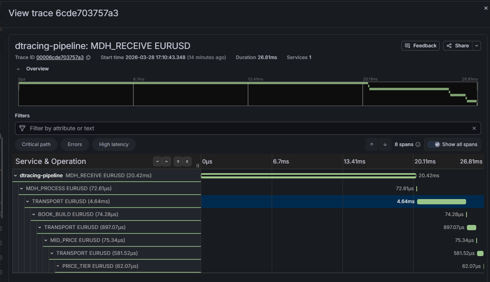
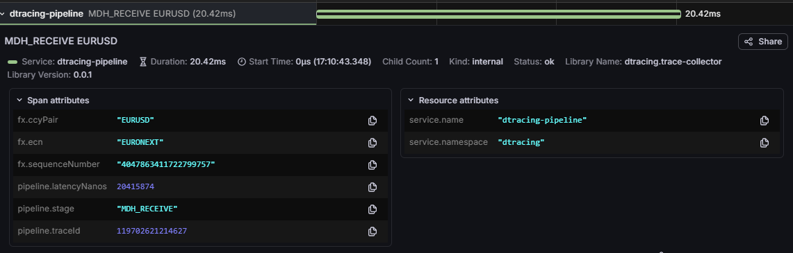

# dtracing — FX Pricing Pipeline Architecture

## Table of Contents

1. [System Overview](#1-system-overview)
2. [Modules](#2-modules)
3. [Message Flow](#3-message-flow)
4. [SBE Message Structures](#4-sbe-message-structures)
5. [Order Books](#5-order-books)
6. [Tracing Architecture](#6-tracing-architecture)
7. [Grafana Waterfall](#7-grafana-waterfall)
8. [Simulator](#8-simulator)

---

## 1. System Overview

dtracing is a low-latency FX pricing pipeline that receives raw market data ticks from multiple
electronic communication networks (ECNs), builds composite order books, calculates mid prices, and
distributes tiered prices to clients. Every tick is traced end-to-end with nanosecond precision.

```
┌──────────────────────────────────────────────────────────────────────────────────────┐
│                                   dtracing pipeline                                  │
│                                                                                      │
│  ┌──────────┐  UDP   ┌──────────────────┐  Aeron  ┌─────────────┐  Aeron            │
│  │Simulator │──────▶ │MarketDataHandler │────────▶│ BookBuilder │──────────────┐    │
│  │  (ECN    │        │  (per ECN)       │         │             │              │    │
│  │  feeds)  │        └──────────────────┘         └─────────────┘              │    │
│  └──────────┘                                                                   │    │
│                                                                       Aeron     ▼    │
│                                                                  ┌─────────────────┐ │
│                                                                  │   MidPricer     │ │
│                                                                  └────────┬────────┘ │
│                                                                   Aeron   │          │
│                                                                           ▼          │
│                                                                  ┌─────────────────┐ │
│                                                                  │  PriceTiering   │ │
│                                                                  └─────────────────┘ │
│                                                                                      │
│  Each stage publishes TraceSpan messages on a dedicated Aeron trace channel          │
│                                │                                                     │
│                                ▼                                                     │
│                      ┌──────────────────┐   OTLP/gRPC   ┌──────────┐               │
│                      │  TraceCollector  │───────────────▶│  Tempo   │               │
│                      └──────────────────┘                └──────────┘               │
└──────────────────────────────────────────────────────────────────────────────────────┘
```

**Key design principles:**
- All inter-service messages use SBE (Simple Binary Encoding) over Agrona `UnsafeBuffer` — no serialization, no JSON on the hot path
- Every stage pre-allocates its buffers at startup; zero heap allocation per message on the hot path
- Prices are `Decimal5` fixed-point (mantissa × 10⁻⁵): e.g. EURUSD 1.08760 is stored as `108760`
- Trace context (`traceId`, `spanId`) flows through every SBE message, linking all spans for a single tick into one trace

---

## 2. Modules

| Module | Role | Transport in | Transport out |
|---|---|---|---|
| **simulator** | Replays CSV market data files as SBE-encoded UDP datagrams | — | UDP `FxFeedDelta` |
| **market-data-handler** | Receives UDP ticks, maintains per-pair order books (depth 5), publishes BBO | UDP `FxFeedDelta` | Aeron `FxMarketData` |
| **book-builder** | Aggregates BBO from all ECNs into composite books per pair | Aeron `FxMarketData` | Aeron `CompositeBookSnapshot` |
| **mid-pricer** | Finds best bid/ask across venues, calculates mid price | Aeron `CompositeBookSnapshot` | Aeron `MidPriceBook` |
| **price-tiering** | Applies spread matrix to produce tiered client prices | Aeron `MidPriceBook` | (terminal) |
| **common** | SBE schema + generated codecs, `TracePublisher` — shared library | — | — |
| **trace-collector** | Receives `TraceSpan` messages, converts to OTel, exports via OTLP | Aeron `TraceSpan` | OTLP gRPC → Tempo |

---

## 3. Message Flow

### Full tick lifecycle

```
Simulator                  MDH                    BookBuilder          MidPricer         PriceTiering
    │                       │                          │                    │                  │
    │  UDP FxFeedDelta       │                          │                    │                  │
    │──────────────────────▶│                          │                    │                  │
    │                       │ decode + update          │                    │                  │
    │                       │ OrderBook[ccyPair]       │                    │                  │
    │                       │                          │                    │                  │
    │                       │  Aeron FxMarketData      │                    │                  │
    │                       │─────────────────────────▶│                    │                  │
    │                       │                          │ update VenueBook   │                  │
    │                       │                          │ rebuild Composite  │                  │
    │                       │                          │ Book for ccyPair   │                  │
    │                       │                          │                    │                  │
    │                       │                          │  Aeron             │                  │
    │                       │                          │  CompositeBook     │                  │
    │                       │                          │  Snapshot          │                  │
    │                       │                          │───────────────────▶│                  │
    │                       │                          │                    │ find best        │
    │                       │                          │                    │ bid/ask          │
    │                       │                          │                    │ calc mid         │
    │                       │                          │                    │                  │
    │                       │                          │                    │ Aeron            │
    │                       │                          │                    │ MidPriceBook     │
    │                       │                          │                    │─────────────────▶│
    │                       │                          │                    │                  │ apply spreads
    │                       │                          │                    │                  │ per tier
    │                       │                          │                    │                  │
    │◀ ─ ─ ─ ─ ─ ─ ─ ─ ─ ─ ─ ─ ─ ─TraceSpan (via dedicated Aeron trace channel)─ ─ ─ ─ ─ ─ ─│
```

### Aeron channels

Each service-to-service link uses a dedicated Aeron IPC publication/subscription pair.
All `TraceSpan` messages from all stages share a single Aeron trace channel consumed by the
`TraceCollector`.

---

## 4. SBE Message Structures

All messages share a common 8-byte `messageHeader` frame:

```
┌─────────────────────────────────────────────────────────────┐
│                     MessageHeader (8 bytes)                  │
├──────────────┬──────────────┬──────────────┬────────────────┤
│ blockLength  │  templateId  │   schemaId   │    version     │
│   uint16     │   uint16     │   uint16     │    uint16      │
│    offset 0  │   offset 2   │   offset 4   │   offset 6     │
└──────────────┴──────────────┴──────────────┴────────────────┘
```

### FxFeedDelta (template 5) — UDP inbound, 41 bytes

Sent by the simulator to each `MarketDataHandler` instance. One datagram = one price delta for one currency pair.

```
┌────────────────────────────────────────────────────────────────────────────────────┐
│                            FxFeedDelta  (41 bytes)                                 │
├────────────────┬─────────┬────────────────┬───────────────────────────────────────┤
│ sequenceNumber │ ccyPair │   timestamp    │            prices & sizes             │
│    uint64      │  uint8  │    int64       │                                       │
│    offset 0    │offset 8 │   offset 9     │                                       │
├────────────────┴─────────┴────────────────┼──────────────┬──────────┬─────────────┤
│                                           │  askPrice    │ askSize  │  bidPrice   │
│                                           │  Decimal5    │  int32   │  Decimal5   │
│                                           │  offset 17   │ offset 26│  offset 29  │
├───────────────────────────────────────────┴──────────────┴──────────┼─────────────┤
│                                                                      │   bidSize   │
│                                                                      │   int32     │
│                                                                      │  offset 37  │
└──────────────────────────────────────────────────────────────────────┴─────────────┘

Decimal5: mantissa (int64) with implied exponent -5
  e.g. bid=1.08760 → mantissa=108760
       ask=1.08765 → mantissa=108765
```

### FxMarketData (template 1) — MDH → BookBuilder, 66 bytes

Carries the current BBO for one pair from one ECN, plus trace context and the sender's finish timestamp for transport span calculation.

```
┌─────────────────────────────────────────────────────────────────────────────────┐
│                          FxMarketData  (66 bytes)                               │
├────────┬─────────┬────────────┬────────────┬────────┬────────────┬─────────────┤
│  ecn   │ ccyPair │ timestamp  │  bidPrice  │bidSize │  askPrice  │   askSize   │
│ uint8  │  uint8  │   int64    │  Decimal5  │ int32  │  Decimal5  │    int32    │
├────────┴─────────┴────────────┴────────────┴────────┴────────────┴─────────────┤
├────────────────────────────────────────────────────────────────────────────────┤
│           traceId            │           spanId             │  sequenceNumber  │
│           uint64             │           uint64             │      uint64      │
├──────────────────────────────┴──────────────────────────────┴──────────────────┤
│                          senderTimestampOut                                     │
│                              int64 (NanoTimestamp)                              │
│           wall-clock ns when MDH_PROCESS span completed                         │
└─────────────────────────────────────────────────────────────────────────────────┘
```

### CompositeBookSnapshot (template 2) — BookBuilder → MidPricer, 106 bytes

Three positional venue slots (index = ECN ordinal: 0=EURONEXT, 1=EBS, 2=FENICS). Zero bid/ask means no data from that venue yet.

```
┌──────────────────────────────────────────────────────────────────────────────────────┐
│                       CompositeBookSnapshot  (106 bytes)                             │
├─────────┬──────────────┬──────────────────────────────────────────────────────────── ┤
│ ccyPair │ triggeringEcn│            venue slots (3 × 18 bytes each)                  │
│  uint8  │    uint8     │                                                             │
├─────────┴──────────────┤                                                             │
│                        │  slot 0 (EURONEXT)   slot 1 (EBS)     slot 2 (FENICS)      │
│                        ├────────────────────┬────────────────┬─────────────────────  │
│                        │bid Decimal5 int32  │bid Decimal5 i32│bid Decimal5  int32   │
│                        │ask Decimal5 int32  │ask Decimal5 i32│ask Decimal5  int32   │
├────────────────────────┴────────────────────┴────────────────┴─────────────────────  ┤
│        traceId (uint64)          │       spanId (uint64)       │ sequenceNumber(u64) │
├──────────────────────────────────┴─────────────────────────────┴─────────────────────┤
│                              senderTimestampOut (int64)                              │
└──────────────────────────────────────────────────────────────────────────────────────┘
```

### MidPriceBook (template 3) — MidPricer → PriceTiering, 38 bytes

```
┌────────────────────────────────────────────────────────────────┐
│                    MidPriceBook  (38 bytes)                     │
├─────────┬────────────┬─────────┬──────────┬────────┬───────────┤
│ ccyPair │  midPrice  │ midSize │ traceId  │ spanId │    ecn    │
│  uint8  │  Decimal5  │  int32  │  uint64  │ uint64 │   uint8   │
├─────────┴────────────┴─────────┴──────────┴────────┴───────────┤
│              sequenceNumber (uint64)                            │
├─────────────────────────────────────────────────────────────────┤
│              senderTimestampOut (int64)                         │
└─────────────────────────────────────────────────────────────────┘
```

### TraceSpan (template 6) — all stages → TraceCollector, 51 bytes

```
┌──────────────────────────────────────────────────────────────────────────────┐
│                         TraceSpan  (51 bytes)                                │
├──────────────┬──────────────┬──────────────────┬───────┬──────┬─────────────┤
│   traceId    │    spanId    │  parentSpanId    │ stage │ ecn  │   ccyPair   │
│   uint64     │   uint64     │     uint64       │ uint8 │ uint8│    uint8    │
│   offset 0   │   offset 8   │    offset 16     │  o24  │  o25 │    o26      │
├──────────────┴──────────────┴──────────────────┴───────┴──────┴─────────────┤
│         sequenceNumber (uint64)      │   timestampIn (int64)                 │
│             offset 27                │      offset 35                        │
├──────────────────────────────────────┴───────────────────────────────────────┤
│                         timestampOut (int64)                                  │
│                              offset 43                                        │
└───────────────────────────────────────────────────────────────────────────────┘
```

### Enums

**Stage** (uint8) — pipeline stage identifier, also encoded in the upper 16 bits of every `spanId`:

| Value | Name | Description |
|---|---|---|
| 0 | `MDH_RECEIVE` | Exchange publish → UDP receive |
| 1 | `BOOK_BUILD` | Composite book rebuild |
| 2 | `MID_PRICE` | Mid price calculation |
| 3 | `PRICE_TIER` | Spread application |
| 4 | `MDH_PROCESS` | MDH internal processing (decode, book update, Aeron publish) |
| 5 | `TRANSPORT` | Aeron message transit between stages |

**Ecn** (uint8): `EURONEXT=0`, `EBS=1`, `FENICS=2`

**CcyPair** (uint8): `EURUSD=0`, `GBPUSD=1`, `USDJPY=2`, `USDCHF=3`, `AUDUSD=4`, `USDCAD=5`, `NZDUSD=6`, `EURGBP=7`, `EURJPY=8`, `GBPJPY=9`, `EURCHF=10`, `AUDJPY=11`

---

## 5. Order Books

### Per-ECN OrderBook (inside MarketDataHandler)

Each `MarketDataHandler` instance maintains one `OrderBook` per currency pair (12 pairs × 1 instance per ECN). Depth is capped at 5 levels per side. Prices are `Decimal5` mantissas. An update with `size=0` removes that price level.

```
OrderBook for EURUSD (ECN = EBS)

         BID SIDE                          ASK SIDE
  (descending — best at [0])        (ascending — best at [0])

  idx │  price    │  size            idx │  price    │  size
  ────┼───────────┼──────            ────┼───────────┼──────
   0  │  108760   │  5000  ◀ BBO      0  │  108765   │  4000  ◀ BBO
   1  │  108755   │  8000             1  │  108770   │  6000
   2  │  108750   │ 10000             2  │  108775   │  9000
   3  │  108745   │  3000             3  │  108780   │  2000
   4  │  108740   │  7000             4  │  108785   │  5000
```

**Book update example — new bid arrives at 108758 size 6000:**

```
Before:                               After:
  idx │  price    │  size               idx │  price    │  size
  ────┼───────────┼──────               ────┼───────────┼──────
   0  │  108760   │  5000                0  │  108760   │  5000
   1  │  108755   │  8000                1  │  108758   │  6000  ◀ inserted
   2  │  108750   │ 10000                2  │  108755   │  8000  │
   3  │  108745   │  3000                3  │  108750   │ 10000  │ shifted down
   4  │  108740   │  7000                4  │  108745   │  3000  │
                                                                  (108740 evicted — max depth 5)
```

**Level removal — bid at 108755 size 0:**

```
Before:                               After:
  idx │  price    │  size               idx │  price    │  size
  ────┼───────────┼──────               ────┼───────────┼──────
   0  │  108760   │  5000                0  │  108760   │  5000
   1  │  108755   │  8000                1  │  108750   │ 10000  ◀ shifted up
   2  │  108750   │ 10000                2  │  108745   │  3000
   3  │  108745   │  3000                3  │  108740   │  7000
   4  │  108740   │  7000                4  │     0     │     0
```

Only the BBO (index 0) from the `OrderBook` is forwarded downstream in `FxMarketData`.

### Per-ECN VenueBook (inside BookBuilder)

`BookBuilder` holds a flat `VenueBook[ECN_COUNT][CCY_PAIR_COUNT]` grid. Each cell stores only the latest BBO from that ECN for that pair — no depth.

```
VenueBook grid (12 pairs × 3 ECNs)

              EURONEXT           EBS               FENICS
           ┌──────────────┬──────────────┬──────────────┐
  EURUSD   │ bid: 108758  │ bid: 108760  │ bid: 108757  │
           │ ask: 108763  │ ask: 108765  │ ask: 108764  │
           ├──────────────┼──────────────┼──────────────┤
  GBPUSD   │ bid: 126450  │ bid: 126452  │ bid: 126448  │
           │ ask: 126455  │ ask: 126458  │ ask: 126456  │
           ├──────────────┼──────────────┼──────────────┤
  USDJPY   │ bid: 15098200│     —        │ bid: 15098000│
           │ ask: 15098600│     —        │ ask: 15098500│
           └──────────────┴──────────────┴──────────────┘
  ...
```

On every incoming `FxMarketData` the matching cell is updated and the composite book is rebuilt for that pair.

### CompositeBook (inside BookBuilder)

Merges all venue BBOs for one pair into a single depth-3 book (one level per ECN), sorted by price. Each level is tagged with its source ECN.

```
CompositeBook for EURUSD (after all 3 venues have data)

       BID SIDE (best bid first)         ASK SIDE (best ask first)
  ┌─────┬──────────┬──────┬──────────┐  ┌─────┬──────────┬──────┬──────────┐
  │ idx │  price   │ size │   ecn    │  │ idx │  price   │ size │   ecn    │
  ├─────┼──────────┼──────┼──────────┤  ├─────┼──────────┼──────┼──────────┤
  │  0  │  108760  │ 5000 │ EBS      │  │  0  │  108763  │ 4000 │ EURONEXT │
  │  1  │  108758  │ 3000 │ EURONEXT │  │  1  │  108764  │ 7000 │ FENICS   │
  │  2  │  108757  │ 4000 │ FENICS   │  │  2  │  108765  │ 6000 │ EBS      │
  └─────┴──────────┴──────┴──────────┘  └─────┴──────────┴──────┴──────────┘

  best bid = 108760 (EBS)                best ask = 108763 (EURONEXT)
  mid      = (108760 + 108763) / 2 = 108761  → 1.08761
```

**Composite book update — EBS sends new bid 108762:**

```
Before:                                After:
  bid[0] = 108760  EBS                   bid[0] = 108762  EBS      ◀ EBS slot updated,
  bid[1] = 108758  EURONEXT              bid[1] = 108758  EURONEXT   book re-sorted
  bid[2] = 108757  FENICS                bid[2] = 108757  FENICS

  new mid = (108762 + 108763) / 2 = 108762  → 1.08762
```

The composite book is fully rebuilt from the `VenueBook` grid on every tick — O(3) per side.

### Tiered prices (inside PriceTiering)

A pre-computed `halfSpreads[ccyPair][tier]` array (Decimal5 mantissa units) is applied symmetrically around the mid:

```
Mid price: 108761  (EURUSD 1.08761)

Tier │ half-spread │     bid      │     ask
─────┼─────────────┼──────────────┼──────────────
  1  │      2      │ 108759 (T1)  │ 108763 (T1)    ← tightest (institutional)
  2  │      5      │ 108756 (T2)  │ 108766 (T2)
  3  │     10      │ 108751 (T3)  │ 108771 (T3)
  4  │     20      │ 108741 (T4)  │ 108781 (T4)    ← widest (retail)
```

---

## 6. Tracing Architecture

### Span ID encoding

`TracePublisher` encodes the stage ordinal into the upper 16 bits of every span ID it generates, ensuring uniqueness across services even when span counters reset:

```
spanId = (stage.value() << 48) | ++counter

stage=0 (MDH_RECEIVE):  0x0000_0000_0000_0001, 0x0000_0000_0000_0002, ...
stage=1 (BOOK_BUILD):   0x0001_0000_0000_0001, 0x0001_0000_0000_0002, ...
stage=5 (TRANSPORT):    0x0005_0000_0000_0001, 0x0005_0000_0000_0002, ...
```

### Trace context propagation through the pipeline

Every SBE inter-service message carries `traceId`, `spanId`, and `senderTimestampOut`. The `traceId` is generated once at the root (`MarketDataDeltaProcessor`) and flows unchanged. Each stage reads the upstream `spanId` as its parent, then publishes its own `spanId` downstream.

```
  FxFeedDelta arrives
       │
  MDH generates traceId
       │
  ┌────┴───────────────────────────────────────────────────┐
  │  MDH_RECEIVE span                                      │
  │  traceId = T                                           │
  │  spanId  = S1  (parentSpanId = 0)                     │
  │  in  = feedTimestamp (exchange publish time)           │
  │  out = wall-clock at onDelta() entry                   │
  └────┬───────────────────────────────────────────────────┘
       │
  ┌────┴───────────────────────────────────────────────────┐
  │  MDH_PROCESS span                                      │
  │  traceId = T                                           │
  │  spanId  = S2  (parentSpanId = S1)                    │
  │  in  = wall-clock at onDelta() entry                   │
  │  out = wall-clock after book update + Aeron publish    │
  └────┬───────────────────────────────────────────────────┘
       │ FxMarketData carries: traceId=T, spanId=S2, senderTimestampOut=out2
       │
  ┌────┴───────────────────────────────────────────────────┐
  │  TRANSPORT span  (MDH → BookBuilder)                   │
  │  traceId = T                                           │
  │  spanId  = S3  (parentSpanId = S2)                    │
  │  in  = senderTimestampOut from FxMarketData (= out2)  │
  │  out = wall-clock at onMarketData() entry              │
  └────┬───────────────────────────────────────────────────┘
       │
  ┌────┴───────────────────────────────────────────────────┐
  │  BOOK_BUILD span                                       │
  │  traceId = T                                           │
  │  spanId  = S4  (parentSpanId = S3)                    │
  │  in  = wall-clock at onMarketData() entry              │
  │  out = wall-clock after composite rebuild + publish    │
  └────┬───────────────────────────────────────────────────┘
       │ CompositeBookSnapshot carries: traceId=T, spanId=S4, senderTimestampOut=out4
       │
       │   (same TRANSPORT + processing pattern for MID_PRICE and PRICE_TIER)
       ▼
```

### TraceSpan publication path

All stages share the same `TracePublisher.publishSpan()` call. Each service has its own `TracePublisher` instance connected to the same Aeron trace channel.

```
Stage process()
    │
    ├── tracePublisher.publishSpan(traceId, parentSpanId, stage, ecn, ccyPair, seq, tsIn, tsOut)
    │       │
    │       ├── encode TraceSpan into pre-allocated UnsafeBuffer  (zero allocation)
    │       └── publication.offer(buffer, 0, BUF_SIZE)
    │
    └── (TraceSpan travels over Aeron to TraceCollector)
              │
              ▼
        TraceCollector.onTraceSpan(decoder)
              │
              ├── build OTel Attributes  (stage, ecn, ccyPair, sequenceNumber, latencyNanos)
              ├── build PipelineSpanData (immutable SpanData record)
              └── add to batch
                    │
                    └── when batch reaches 64 spans:
                          exporter.export(batch)  ──OTLP gRPC──▶  Tempo
```

---

## 7. Grafana Waterfall

### Span hierarchy for one tick

Every tick generates exactly **8 spans** in one trace:

```
MDH_RECEIVE ─────────────────────────────────────────────────────────────── (root, parentSpanId=0)
  └── MDH_PROCESS ──────────────────────                                     (parent=MDH_RECEIVE)
        └── TRANSPORT ─────────────────────────────────────                  (parent=MDH_PROCESS)
              └── BOOK_BUILD ─────────                                        (parent=TRANSPORT)
                    └── TRANSPORT ──────────────────────                      (parent=BOOK_BUILD)
                          └── MID_PRICE ─────                                 (parent=TRANSPORT)
                                └── TRANSPORT ──────────────────              (parent=MID_PRICE)
                                      └── PRICE_TIER ─────                    (parent=TRANSPORT)
```

### Grafana timeline view (based on real trace data)

The trace below is from a real EURGBP EURONEXT tick. Times are relative to the MDH_RECEIVE start (t=0).

```
Span                t=0                        +440ms              +440.8ms
──────────────────────────────────────────────────────────────────────────────────────
MDH_RECEIVE         ████████████████████████████████████████████░             440ms
                    ↑ exchange publish time                      ↑ received

MDH_PROCESS                                                      ▓            0.82ms

TRANSPORT (MDH→BB)                                                ▒▒▒▒▒       1.51ms

BOOK_BUILD                                                                ░   0.02ms

TRANSPORT (BB→MP)                                                          ▒▒ 0.58ms

MID_PRICE                                                                    ░ 0.02ms

TRANSPORT (MP→PT)                                                              ▒ 0.37ms

PRICE_TIER                                                                      ░ 0.10ms
──────────────────────────────────────────────────────────────────────────────────────
Total end-to-end:  ~443ms  (dominated by MDH_RECEIVE = network transit from exchange)
Processing only:   ~2.9ms  (MDH_PROCESS + BOOK_BUILD + MID_PRICE + PRICE_TIER)
Aeron transport:   ~2.5ms  (3 × TRANSPORT spans)

Legend:  ███ MDH_RECEIVE  ▓ MDH_PROCESS  ▒ TRANSPORT  ░ processing spans
```
### Example Grafana screenshots

Waterfall diagram of a market data tick flowing through the system



Context of the span



### OTel span attributes

Each span in Grafana carries these attributes:

| Attribute | Example value | Description |
|---|---|---|
| `pipeline.stage` | `BOOK_BUILD` | Stage enum name |
| `fx.ecn` | `EURONEXT` | Source ECN |
| `fx.ccyPair` | `EURGBP` | Currency pair |
| `fx.sequenceNumber` | `4047857354993561578` | Original feed sequence number — links spans across traces for the same feed stream |
| `pipeline.traceId` | `118045079153679` | Internal uint64 trace ID (also encoded in the OTel traceId hex) |
| `pipeline.latencyNanos` | `821230` | `timestampOut - timestampIn` for this span |

### Span naming

Span names follow the pattern `{STAGE} {CCY_PAIR}`, e.g.:
- `MDH_RECEIVE EURGBP`
- `TRANSPORT EURGBP`
- `BOOK_BUILD EURGBP`

This allows filtering in Grafana/Tempo by stage or pair independently using the attributes.

### Trace ID format

The uint64 `traceId` generated by `MarketDataDeltaProcessor` is encoded into a 32-character hex string for OTel:

```
traceId (uint64) = 118045079153679
               → "000000000000000000006b5c8302ac0f"

spanId  (uint64) = 0x0000_0000_0000_0081  (MDH_RECEIVE, counter=0x81)
               → "0000000000000081"

parentSpanId = "" (empty string = root span in OTel)
```

---

## 8. Simulator

`FeedReplayTask` replays a CSV file for one ECN to one `MarketDataHandler` UDP port. It:

1. Encodes each CSV row as a `FxFeedDelta` SBE datagram
2. Rebases timestamps: CSV deltas are preserved but anchored to the current wall-clock time
3. Paces delivery using `LockSupport.parkNanos()` scaled by a `speedMultiplier` (1.0 = real-time, 10.0 = 10× faster)
4. Assigns a contiguous `sequenceNumber` seeded from `System.nanoTime()` XOR ECN hash — unique per ECN process restart

**CSV format:**

```
# sequence_number, ecn, ccy_pair, timestamp_ns, bid_price, bid_size, ask_price, ask_size
1, EBS, EURUSD, 1774712585000000000, 1.08760, 5000, 1.08765, 4000
2, EBS, EURUSD, 1774712585001000000, 1.08758, 8000, 1.08763, 6000
3, EBS, GBPUSD, 1774712585002000000, 1.26450, 3000, 1.26455, 2000
```

Prices in CSV are decimal strings (`1.08760`). `FeedReplayTask.decimalToMantissa()` converts them to `Decimal5` mantissa without `BigDecimal` — zero allocation, integer arithmetic only.
